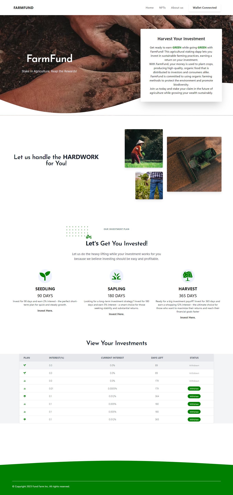

# Farm Fund

Farm Fund is a revolutionary agric-tech Defi that empowers farmers and other agricultural stakeholders to secure capital for crop and tree planning. Utilizing cutting-edge blockchain technology, Farm Fund operates a secure and transparent platform that enables investors to invest in tokens and earn returns based on a percentage of their total investment.

## Project Snapshot



# IMPORTANT ANNOUNCEMENT!

> **PLEASE NOTE :** WHEN TESTING THIS DAPP WITH IT'S URL JUST BELOW, PLEASE USE **MATIC'S MUMBAI TESTNET**. BUT WHEN TESTING THIS DAPP LOCALLY, PLEASE USE THE SAME TOKEN YOU USED IN DEPLOYING THE SMART CONTRACT TO INVEST IN THE FRONTEND. ie; IF YOU USED MATIC TO DEPLOY THE SMART CONTRACT, USE MATIC TO INVEST.

## Project Website Link

[https://farm-fund.vercel.app/](https://farm-fund.vercel.app/)

## Project Author

[Chidozie Zeno Ezeanekwe ](https://www.linkedin.com/in/chidozieezeanekwe/)

## The Smart Contract

This is a Smart Contract written in Solidity for managing investments. The contract allows investors to make investments with a specified duration and calculates interest earned on the investment. The contract also provides functions for the fund manager to modify investment durations and unlock dates, and for investors to retrieve investment details.

- The contract defines a struct called Investment to store investment information, and creates an instance of this struct called investment. The contract also defines public variables and mappings to store investment-related data.

- The **constructor** initializes the fund manager, current investment ID, interest rates, and investment durations. The invest function allows investors to make investments with a specified duration and calculates interest earned on the investment. The calculateInvestmentInterest function calculates the interest earned on an investment.

- The **modifyInvestmentDuration** function allows the fund manager to modify investment durations and set the interest rate basis points for the specified investment duration in days. The getInvestmentDuration function returns the list of investment durations, and the getInterestRate function returns the interest rate basis points for the specified investment duration in days.

- The **retrieveInvestment** function returns the investment details for the specified investment ID, and the getUserAddressInvestmentId function returns the list of investment IDs for the specified investor address. The setNewMaturityDate function allows the fund manager to modify unlock dates for investments.

- Finally, the contract defines a modifier called **onlyNonEmptyAddress** to check that an address is not empty, and an **endInvestment** function that allows investors to end their investments and receive their invested token plus interest earned.

## The Frontend

Built with Next.js, this interacts with the Farm Fund Ethereum smart contract using the Ethers.js library. The component defines state variables to manage the user interface, including **amount, signer, provider, contract, Investments, UserAddress, InvestmentIds, InvestmentInput, InvestmentDuration, and InvestmentPercentage**.

The component uses the useEffect hook to initialize the **provider** and contract state variables when the component mounts. It then defines several helper functions, including **getSigner**, which retrieves the **signer** needed to sign transactions on the Ethereum network, **daysToMaturity**, which calculates the number of days remaining until a maturity date, and **convertToEther**, which converts a value in wei to ether.

The component also defines a **getUserInvestments** function that retrieves the investments made by a user using their investment IDs. The function queries the smart contract for each investment ID to retrieve the investment details and then parses the details into an array of objects. The parsed investments are saved using the **setInvestments** function.

The component also imports several React components and hooks, including **InvestmentHeader**, **InvestmentPlan**, **InvestmentForm**, **InvestmentList**, **HeroBanner**, **Header**, **NavBar**, **Footer**, **useEffect**, and useState. It also imports icons from the react-icons library and the ethers library for interacting with the Ethereum blockchain.

## Dependencies

The project uses the following dependencies;

- React.js - used to create the frontend of the application
- Ethers.js - used to communicate with the Ethereum blockchain
- HardHat - used to interact with the Ethereum blockchain
- dotenv - used to access environment variables
- Tailwindcss - used to style the frontend
- react-icons - icons used in the project

## How To Clone and Use The Project

1. Clone the project by running the command

```sh
 git clone https://github.com/zenodavids/Farm-Fund.git
```

2. Install the dependencies by running the command

```sh
 npm i
```

3. Run the application by running the command

```sh
 npm run dev
```

4. Connect your wallet to the application
5. Make your investment.

### License

- This project is licensed under the **MIT** License.
- **Grandida** is a License partner.

### Attribution

Some parts of the code were adapted from OpenZeppelin

> **DO NOT USE WITHOUT THE PERMISSION OF GRANDIDA**
